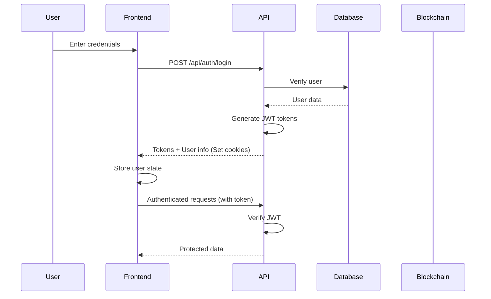

# 🔌 BlockVote API Integration Guide

**Version**: 1.0  
**Last Updated**: November 2025  
**Framework**: Next.js 15 with TypeScript  
**Architecture**: API Routes (Backend) + React Components (Frontend)

## 📋 Table of Contents

- [Overview](#overview)
- [Authentication](#authentication)
- [API Endpoints](#api-endpoints)
- [Next.js Integration Patterns](#nextjs-integration-patterns)
- [Data Models](#data-models)
- [Error Handling](#error-handling)
- [Best Practices](#best-practices)
- [Code Examples](#code-examples)

## 🎯 Overview

BlockVote is built on Next.js 15, combining backend API routes and frontend React components in a single project. This guide provides comprehensive information on integrating the API endpoints into your Next.js frontend.

### Architecture

```
┌─────────────────────────────────────────────┐
│         Next.js Application                  │
│                                              │
│  ┌──────────────┐      ┌──────────────┐    │
│  │   Frontend   │◄────►│   API Routes │    │
│  │  Components  │      │   (Backend)  │    │
│  └──────────────┘      └──────────────┘    │
│         │                      │            │
│         │                      ▼            │
│         │              ┌──────────────┐    │
│         │              │   Prisma ORM │    │
│         │              │   Database   │    │
│         │              └──────────────┘    │
│         │                      │            │
│         ▼                      ▼            │
│  ┌──────────────────────────────────┐      │
│  │      Blockchain Integration      │      │
│  └──────────────────────────────────┘      │
└─────────────────────────────────────────────┘
```

### Key Features

- **Server-Side API Routes**: RESTful endpoints in `/app/api`
- **Client-Side Components**: React components in `/app` and `/components`
- **TypeScript**: Full type safety across the stack
- **Authentication**: JWT-based with HTTP-only cookies
- **Blockchain**: Integrated voting system with cryptographic security

## 🔐 Authentication

### Authentication Flow



### Token Management

BlockVote uses two types of JWT tokens:

1. **Access Token**: Short-lived (15 minutes), used for API requests
2. **Refresh Token**: Long-lived (7 days), used to obtain new access tokens

Both tokens are stored in HTTP-only cookies for security.

### Authentication Headers

```typescript
// Authorization header format
Authorization: Bearer <access_token>

// Or rely on HTTP-only cookies (automatically sent by browser)
```

## 🌐 API Endpoints

### Authentication Endpoints

#### POST /api/auth/login
Login with username/email and password.

**Request:**
```typescript
{
  identifier: string;  // Username or email
  password: string;
}
```

**Response:**
```typescript
{
  success: boolean;
  message: string;
  user: {
    id: number;
    email: string;
    username: string;
    role: "ADMIN" | "ORGANIZATION" | "VOTER";
    status: string;
    lastLoginAt: string;
    createdAt: string;
  };
  tokens: {
    accessToken: string;
    refreshToken: string;
    expiresIn: number;
    tokenType: "Bearer";
  };
}
```

**Example:**
```typescript
const response = await fetch('/api/auth/login', {
  method: 'POST',
  headers: { 'Content-Type': 'application/json' },
  body: JSON.stringify({
    identifier: 'admin@blockvote.com',
    password: 'admin123!'
  })
});

const data = await response.json();
if (data.success) {
  // Store user info in state
  // Tokens are automatically stored in HTTP-only cookies
}
```

#### POST /api/auth/register
Register a new organization.

**Request:**
```typescript
{
  organizationName: string;
  contactEmail: string;
  contactName: string;
  phone?: string;
  website?: string;
  description: string;
  address: {
    street: string;
    city: string;
    state: string;
    zipCode: string;
    country: string;
  };
  username: string;
  password: string;
}
```

**Response:**
```typescript
{
  success: boolean;
  message: string;
  registrationId?: string;
  expiresAt?: string;
}
```

#### POST /api/auth/logout
Logout current user.

**Request:** No body required

**Response:**
```typescript
{
  success: boolean;
  message: string;
}
```

#### GET /api/auth/me
Get current authenticated user information.

**Headers:** `Authorization: Bearer <token>`

**Response:**
```typescript
{
  success: boolean;
  user: {
    id: number;
    email: string;
    username: string;
    firstName?: string;
    lastName?: string;
    studentId?: string;
    role: "ADMIN" | "ORGANIZATION" | "VOTER";
    status: string;
    emailVerified: boolean;
    lastLoginAt: string;
    createdAt: string;
  };
}
```

#### POST /api/auth/refresh
Refresh access token using refresh token.

**Request:** No body required (uses refresh token from cookies)

**Response:**
```typescript
{
  success: boolean;
  tokens: {
    accessToken: string;
    refreshToken: string;
    expiresIn: number;
  };
}
```

#### POST /api/auth/password-reset
Request password reset.

**Request:**
```typescript
{
  email: string;
}
```

**Response:**
```typescript
{
  success: boolean;
  message: string;
}
```

#### PUT /api/auth/password-reset
Complete password reset with token.

**Request:**
```typescript
{
  token: string;
  newPassword: string;
}
```

**Response:**
```typescript
{
  success: boolean;
  message: string;
}
```

### Organization Endpoints

#### GET /api/organization/elections
Get all elections for the authenticated organization.

**Headers:** `Authorization: Bearer <token>`

**Response:**
```typescript
{
  success: boolean;
  data: Array<{
    id: number;
    title: string;
    description: string;
    status: "DRAFT" | "ACTIVE" | "COMPLETED" | "CANCELLED";
    startDate: string;
    endDate: string;
    organizationId: number;
    candidates: Array<{
      id: number;
      name: string;
      description: string;
    }>;
    _count: {
      votes: number;
    };
    createdAt: string;
    updatedAt: string;
  }>;
}
```

#### POST /api/organization/elections
Create a new election.

**Headers:** `Authorization: Bearer <token>`

**Request:**
```typescript
{
  title: string;
  description: string;
  startDate: string; // ISO 8601 format
  endDate: string;   // ISO 8601 format
  candidates: Array<{
    name: string;
    description: string;
  }>;
}
```

**Response:**
```typescript
{
  success: boolean;
  message: string;
  data: {
    id: number;
    title: string;
    description: string;
    status: "DRAFT";
    startDate: string;
    endDate: string;
    organizationId: number;
    candidates: Array<{
      id: number;
      name: string;
      description: string;
    }>;
  };
}
```

**Validation Rules:**
- Title: Required
- Description: Required
- Start date: Must be in the future
- End date: Must be after start date
- Candidates: Minimum 2 candidates required

#### GET /api/organization/stats
Get organization statistics.

**Headers:** `Authorization: Bearer <token>`

**Response:**
```typescript
{
  success: boolean;
  data: {
    totalElections: number;
    activeElections: number;
    totalVotes: number;
    totalVoters: number;
  };
}
```

### Voter Endpoints

#### GET /api/voter/elections
Get elections available to the authenticated voter.

**Headers:** `Authorization: Bearer <token>`

**Response:**
```typescript
{
  success: boolean;
  data: Array<{
    id: number;
    title: string;
    description: string;
    status: "DRAFT" | "ACTIVE" | "COMPLETED" | "CANCELLED";
    startDate: string;
    endDate: string;
    organizationId: number;
    organization: {
      username: string;
      email: string;
    };
    candidates: Array<{
      id: number;
      name: string;
      description: string;
    }>;
    hasVoted: boolean;
    voteId?: number;
    votedAt?: string;
    canVote: boolean;
    remainingTime: number; // milliseconds
    voterRegistrationId: number;
  }>;
}
```

#### POST /api/voter/vote
Cast a vote in an election.

**Headers:** `Authorization: Bearer <token>`

**Request:**
```typescript
{
  electionId: number;
  candidateId: number;
  signature?: string; // Optional cryptographic signature
}
```

**Response:**
```typescript
{
  success: boolean;
  message: string;
  data: {
    voteId: number;
    electionId: number;
    candidateId: number;
    votedAt: string;
    blockHash: string;
    transactionHash: string;
  };
}
```

#### GET /api/voter/dashboard
Get voter dashboard statistics.

**Headers:** `Authorization: Bearer <token>`

**Response:**
```typescript
{
  success: boolean;
  data: {
    totalElections: number;
    activeElections: number;
    votesCount: number;
    pendingInvitations: number;
  };
}
```

### Voter Management Endpoints

#### POST /api/voters
Bulk create voters for an election.

**Headers:** `Authorization: Bearer <token>`

**Request:**
```typescript
{
  electionId: number;
  organizationId: number;
  voters: Array<{
    name: string;
    email: string;
    username?: string;
    metadata?: Record<string, any>;
  }>;
  generatePasswords?: boolean;  // Default: true
  passwordLength?: number;      // Default: 12, min: 8, max: 32
  sendCredentials?: boolean;    // Default: false
}
```

**Response:**
```typescript
{
  success: boolean;
  message: string;
  summary: {
    total: number;
    successful: number;
    failed: number;
  };
  results: Array<{
    success: boolean;
    voter: {
      id: number;
      name: string;
      email: string;
      username: string;
      password?: string; // Only if generatePasswords is true and sendCredentials is false
    };
    error?: string;
  }>;
}
```

#### PUT /api/voters
Upload voters via CSV.

**Headers:** `Authorization: Bearer <token>`

**Request:**
```typescript
{
  electionId: number;
  organizationId: number;
  csvContent: string;  // CSV format: name,email,username (optional)
  generatePasswords?: boolean;
  passwordLength?: number;
  sendCredentials?: boolean;
}
```

**CSV Format:**
```csv
name,email,username
John Doe,john@example.com,johndoe
Jane Smith,jane@example.com,janesmith
```

**Response:** Same as POST /api/voters

### Admin Endpoints

#### GET /api/admin/stats
Get system-wide statistics.

**Headers:** `Authorization: Bearer <token>` (Admin only)

**Response:**
```typescript
{
  success: boolean;
  data: {
    totalUsers: number;
    totalOrganizations: number;
    totalVoters: number;
    totalElections: number;
    activeElections: number;
    totalVotes: number;
    systemHealth: string;
  };
}
```

#### GET /api/admin/organizations/pending
Get pending organization registrations.

**Headers:** `Authorization: Bearer <token>` (Admin only)

**Response:**
```typescript
{
  success: boolean;
  data: Array<{
    id: number;
    organizationName: string;
    contactEmail: string;
    contactName: string;
    status: "PENDING" | "APPROVED" | "REJECTED";
    submittedAt: string;
  }>;
}
```

#### POST /api/admin/organizations/:id/approve
Approve an organization registration.

**Headers:** `Authorization: Bearer <token>` (Admin only)

**Response:**
```typescript
{
  success: boolean;
  message: string;
}
```

#### POST /api/admin/organizations/:id/reject
Reject an organization registration.

**Headers:** `Authorization: Bearer <token>` (Admin only)

**Request:**
```typescript
{
  reason?: string;
}
```

**Response:**
```typescript
{
  success: boolean;
  message: string;
}
```

#### GET /api/admin/users
Get all users in the system.

**Headers:** `Authorization: Bearer <token>` (Admin only)

**Query Parameters:**
- `role?: "ADMIN" | "ORGANIZATION" | "VOTER"`
- `status?: "ACTIVE" | "INACTIVE"`
- `page?: number` (default: 1)
- `limit?: number` (default: 20)

**Response:**
```typescript
{
  success: boolean;
  data: {
    users: Array<{
      id: number;
      username: string;
      email: string;
      firstName?: string;
      lastName?: string;
      studentId?: string;
      role: string;
      status: string;
      emailVerified: boolean;
      lastLoginAt: string;
      createdAt: string;
    }>;
    pagination: {
      page: number;
      limit: number;
      total: number;
      totalPages: number;
    };
  };
}
```

#### GET /api/admin/audit
Get audit logs.

**Headers:** `Authorization: Bearer <token>` (Admin only)

**Query Parameters:**
- `userId?: number`
- `action?: string`
- `entityType?: string`
- `startDate?: string`
- `endDate?: string`
- `page?: number`
- `limit?: number`

**Response:**
```typescript
{
  success: boolean;
  data: {
    logs: Array<{
      id: number;
      userId: number;
      action: string;
      entityType: string;
      entityId?: number;
      details?: string;
      ipAddress: string;
      userAgent: string;
      createdAt: string;
    }>;
    pagination: {
      page: number;
      limit: number;
      total: number;
      totalPages: number;
    };
  };
}
```

## 🔄 Next.js Integration Patterns

### Server-Side Rendering (SSR)

Use Server Components to fetch data during SSR:

```typescript
// app/dashboard/page.tsx
import { headers } from 'next/headers';

async function getDashboardData() {
  const headersList = headers();
  const cookie = headersList.get('cookie');
  
  const res = await fetch('http://localhost:3000/api/organization/elections', {
    headers: {
      cookie: cookie || '',
    },
    cache: 'no-store', // Don't cache
  });
  
  if (!res.ok) throw new Error('Failed to fetch');
  return res.json();
}

export default async function DashboardPage() {
  const data = await getDashboardData();
  
  return (
    <div>
      <h1>Dashboard</h1>
      {/* Render data */}
    </div>
  );
}
```

### Client-Side Fetching

Use React hooks for client-side data fetching:

```typescript
// components/ElectionList.tsx
'use client';

import { useState, useEffect } from 'react';

interface Election {
  id: number;
  title: string;
  description: string;
  status: string;
  startDate: string;
  endDate: string;
}

export function ElectionList() {
  const [elections, setElections] = useState<Election[]>([]);
  const [loading, setLoading] = useState(true);
  const [error, setError] = useState<string | null>(null);

  useEffect(() => {
    async function fetchElections() {
      try {
        const res = await fetch('/api/organization/elections');
        const data = await res.json();
        
        if (data.success) {
          setElections(data.data);
        } else {
          setError(data.message);
        }
      } catch (err) {
        setError('Failed to fetch elections');
      } finally {
        setLoading(false);
      }
    }

    fetchElections();
  }, []);

  if (loading) return <div>Loading...</div>;
  if (error) return <div>Error: {error}</div>;

  return (
    <div>
      {elections.map(election => (
        <div key={election.id}>
          <h2>{election.title}</h2>
          <p>{election.description}</p>
          <p>Status: {election.status}</p>
        </div>
      ))}
    </div>
  );
}
```

### API Route Helpers

Create reusable API client helpers:

```typescript
// lib/api-client.ts
type RequestOptions = {
  method?: 'GET' | 'POST' | 'PUT' | 'DELETE';
  headers?: Record<string, string>;
  body?: any;
};

export class ApiClient {
  private baseUrl: string;
  private token?: string;

  constructor(baseUrl: string = '/api') {
    this.baseUrl = baseUrl;
  }

  setToken(token: string) {
    this.token = token;
  }

  async request<T>(endpoint: string, options: RequestOptions = {}): Promise<T> {
    const { method = 'GET', headers = {}, body } = options;

    const config: RequestInit = {
      method,
      headers: {
        'Content-Type': 'application/json',
        ...(this.token && { Authorization: `Bearer ${this.token}` }),
        ...headers,
      },
      credentials: 'include', // Include cookies
    };

    if (body) {
      config.body = JSON.stringify(body);
    }

    const response = await fetch(`${this.baseUrl}${endpoint}`, config);
    const data = await response.json();

    if (!response.ok) {
      throw new Error(data.message || 'Request failed');
    }

    return data;
  }

  // Auth methods
  async login(identifier: string, password: string) {
    return this.request('/auth/login', {
      method: 'POST',
      body: { identifier, password },
    });
  }

  async logout() {
    return this.request('/auth/logout', { method: 'POST' });
  }

  async getCurrentUser() {
    return this.request('/auth/me');
  }

  // Organization methods
  async getElections() {
    return this.request('/organization/elections');
  }

  async createElection(data: any) {
    return this.request('/organization/elections', {
      method: 'POST',
      body: data,
    });
  }

  // Voter methods
  async getVoterElections() {
    return this.request('/voter/elections');
  }

  async castVote(electionId: number, candidateId: number) {
    return this.request('/voter/vote', {
      method: 'POST',
      body: { electionId, candidateId },
    });
  }
}

// Usage
const api = new ApiClient();
export default api;
```

### Context Provider for Auth

Create an authentication context:

```typescript
// contexts/AuthContext.tsx
'use client';

import { createContext, useContext, useState, useEffect, ReactNode } from 'react';
import api from '@/lib/api-client';

interface User {
  id: number;
  email: string;
  username: string;
  role: string;
  status: string;
}

interface AuthContextType {
  user: User | null;
  loading: boolean;
  login: (identifier: string, password: string) => Promise<void>;
  logout: () => Promise<void>;
  refreshUser: () => Promise<void>;
}

const AuthContext = createContext<AuthContextType | undefined>(undefined);

export function AuthProvider({ children }: { children: ReactNode }) {
  const [user, setUser] = useState<User | null>(null);
  const [loading, setLoading] = useState(true);

  useEffect(() => {
    // Check if user is logged in on mount
    async function checkAuth() {
      try {
        const response = await api.getCurrentUser();
        if (response.success) {
          setUser(response.user);
        }
      } catch (error) {
        // Not logged in
      } finally {
        setLoading(false);
      }
    }

    checkAuth();
  }, []);

  const login = async (identifier: string, password: string) => {
    const response = await api.login(identifier, password);
    if (response.success) {
      setUser(response.user);
      api.setToken(response.tokens.accessToken);
    }
  };

  const logout = async () => {
    await api.logout();
    setUser(null);
    api.setToken('');
  };

  const refreshUser = async () => {
    try {
      const response = await api.getCurrentUser();
      if (response.success) {
        setUser(response.user);
      }
    } catch (error) {
      setUser(null);
    }
  };

  return (
    <AuthContext.Provider value={{ user, loading, login, logout, refreshUser }}>
      {children}
    </AuthContext.Provider>
  );
}

export function useAuth() {
  const context = useContext(AuthContext);
  if (!context) {
    throw new Error('useAuth must be used within AuthProvider');
  }
  return context;
}
```

### Protected Routes

Create middleware for protected routes:

```typescript
// middleware.ts
import { NextResponse } from 'next/server';
import type { NextRequest } from 'next/server';
import { auth } from '@/lib/auth/jwt';

export function middleware(request: NextRequest) {
  const token = request.cookies.get('accessToken')?.value;

  if (!token) {
    return NextResponse.redirect(new URL('/login', request.url));
  }

  try {
    const verification = auth.verifyToken(token);
    if (!verification.isValid) {
      return NextResponse.redirect(new URL('/login', request.url));
    }

    // Check role-based access
    const { pathname } = request.nextUrl;
    const role = verification.payload?.role;

    if (pathname.startsWith('/admin') && role !== 'admin') {
      return NextResponse.redirect(new URL('/unauthorized', request.url));
    }

    if (pathname.startsWith('/organization') && role !== 'organization') {
      return NextResponse.redirect(new URL('/unauthorized', request.url));
    }

    if (pathname.startsWith('/voter') && role !== 'voter') {
      return NextResponse.redirect(new URL('/unauthorized', request.url));
    }

    return NextResponse.next();
  } catch (error) {
    return NextResponse.redirect(new URL('/login', request.url));
  }
}

export const config = {
  matcher: ['/admin/:path*', '/organization/:path*', '/voter/:path*', '/dashboard/:path*'],
};
```

## 📊 Data Models

### User Model
```typescript
interface User {
  id: number;
  studentId?: string;
  username: string;
  email: string;
  firstName?: string;
  lastName?: string;
  passwordHash: string;
  role: "ADMIN" | "ORGANIZATION" | "VOTER";
  publicKey?: string;
  privateKeyEncrypted?: string;
  status: "ACTIVE" | "INACTIVE";
  emailVerified: boolean;
  emailVerificationToken?: string;
  lastLoginAt?: Date;
  createdAt: Date;
  updatedAt: Date;
}
```

### Election Model
```typescript
interface Election {
  id: number;
  title: string;
  description: string;
  organizationId: number;
  status: "DRAFT" | "ACTIVE" | "COMPLETED" | "CANCELLED";
  startDate: Date;
  endDate: Date;
  createdAt: Date;
  updatedAt: Date;
}
```

### Candidate Model
```typescript
interface Candidate {
  id: number;
  electionId: number;
  name: string;
  description: string;
  createdAt: Date;
  updatedAt: Date;
}
```

### Vote Model
```typescript
interface Vote {
  id: number;
  electionId: number;
  voterId: number;
  candidateId: number;
  blockHash: string;
  transactionHash: string;
  votedAt: Date;
  createdAt: Date;
}
```

## ❌ Error Handling

### Standard Error Response

All API endpoints return errors in a consistent format:

```typescript
{
  success: false;
  message: string;      // Human-readable error message
  error?: string;       // Error type or code
  details?: string;     // Additional error details
  errors?: Array<{      // Validation errors
    field: string;
    message: string;
  }>;
}
```

### HTTP Status Codes

| Code | Meaning | Usage |
|------|---------|-------|
| 200 | OK | Successful GET, PUT, DELETE |
| 201 | Created | Successful POST |
| 400 | Bad Request | Validation error |
| 401 | Unauthorized | Missing or invalid authentication |
| 403 | Forbidden | Insufficient permissions |
| 404 | Not Found | Resource not found |
| 409 | Conflict | Duplicate resource |
| 500 | Internal Server Error | Server error |

### Error Handling Example

```typescript
async function createElection(data: any) {
  try {
    const response = await fetch('/api/organization/elections', {
      method: 'POST',
      headers: { 'Content-Type': 'application/json' },
      body: JSON.stringify(data),
    });

    const result = await response.json();

    if (!response.ok) {
      // Handle different error types
      if (response.status === 400) {
        // Validation errors
        if (result.errors) {
          result.errors.forEach((err: any) => {
            console.error(`${err.field}: ${err.message}`);
          });
        }
      } else if (response.status === 401) {
        // Redirect to login
        window.location.href = '/login';
      } else if (response.status === 403) {
        // Show permission error
        alert('You do not have permission to perform this action');
      }
      
      throw new Error(result.message);
    }

    return result;
  } catch (error) {
    console.error('Failed to create election:', error);
    throw error;
  }
}
```

## ✅ Best Practices

### 1. Token Management

```typescript
// Automatic token refresh
let refreshTokenTimeout: NodeJS.Timeout;

function scheduleTokenRefresh(expiresIn: number) {
  // Refresh 1 minute before expiration
  const refreshTime = (expiresIn - 60) * 1000;
  
  refreshTokenTimeout = setTimeout(async () => {
    try {
      const response = await fetch('/api/auth/refresh', {
        method: 'POST',
      });
      
      const data = await response.json();
      if (data.success) {
        scheduleTokenRefresh(data.tokens.expiresIn);
      }
    } catch (error) {
      // Redirect to login
      window.location.href = '/login';
    }
  }, refreshTime);
}
```

### 2. Request Cancellation

```typescript
// Cancel pending requests on component unmount
useEffect(() => {
  const controller = new AbortController();

  async function fetchData() {
    try {
      const response = await fetch('/api/organization/elections', {
        signal: controller.signal,
      });
      // Process response
    } catch (error) {
      if (error.name === 'AbortError') {
        console.log('Request cancelled');
      }
    }
  }

  fetchData();

  return () => controller.abort();
}, []);
```

### 3. Optimistic Updates

```typescript
async function castVote(electionId: number, candidateId: number) {
  // Optimistic update
  setHasVoted(true);
  setVotedCandidateId(candidateId);

  try {
    const response = await api.castVote(electionId, candidateId);
    
    if (response.success) {
      // Update with server response
      setVoteData(response.data);
    } else {
      // Revert optimistic update
      setHasVoted(false);
      setVotedCandidateId(null);
      throw new Error(response.message);
    }
  } catch (error) {
    // Revert optimistic update
    setHasVoted(false);
    setVotedCandidateId(null);
    alert('Failed to cast vote');
  }
}
```

### 4. Loading States

```typescript
function ElectionCreator() {
  const [isSubmitting, setIsSubmitting] = useState(false);

  async function handleSubmit(data: any) {
    setIsSubmitting(true);
    
    try {
      const response = await api.createElection(data);
      // Handle success
    } catch (error) {
      // Handle error
    } finally {
      setIsSubmitting(false);
    }
  }

  return (
    <form onSubmit={handleSubmit}>
      {/* Form fields */}
      <button type="submit" disabled={isSubmitting}>
        {isSubmitting ? 'Creating...' : 'Create Election'}
      </button>
    </form>
  );
}
```

### 5. Data Validation

```typescript
import { z } from 'zod';

const electionSchema = z.object({
  title: z.string().min(3, 'Title must be at least 3 characters'),
  description: z.string().min(10, 'Description must be at least 10 characters'),
  startDate: z.string().refine(
    (date) => new Date(date) > new Date(),
    'Start date must be in the future'
  ),
  endDate: z.string(),
  candidates: z.array(
    z.object({
      name: z.string().min(2),
      description: z.string().min(5),
    })
  ).min(2, 'At least 2 candidates required'),
}).refine(
  (data) => new Date(data.endDate) > new Date(data.startDate),
  'End date must be after start date'
);

function validateElection(data: any) {
  try {
    return electionSchema.parse(data);
  } catch (error) {
    if (error instanceof z.ZodError) {
      const errors = error.issues.map(issue => ({
        field: issue.path.join('.'),
        message: issue.message,
      }));
      throw new Error(JSON.stringify(errors));
    }
    throw error;
  }
}
```

## 📚 Code Examples

### Complete Login Component

```typescript
'use client';

import { useState } from 'react';
import { useRouter } from 'next/navigation';
import { useAuth } from '@/contexts/AuthContext';

export function LoginForm() {
  const [identifier, setIdentifier] = useState('');
  const [password, setPassword] = useState('');
  const [error, setError] = useState('');
  const [loading, setLoading] = useState(false);
  
  const { login } = useAuth();
  const router = useRouter();

  async function handleSubmit(e: React.FormEvent) {
    e.preventDefault();
    setError('');
    setLoading(true);

    try {
      await login(identifier, password);
      
      // Redirect based on role
      const response = await fetch('/api/auth/me');
      const data = await response.json();
      
      if (data.success) {
        const role = data.user.role.toLowerCase();
        router.push(`/${role}/dashboard`);
      }
    } catch (err) {
      setError(err instanceof Error ? err.message : 'Login failed');
    } finally {
      setLoading(false);
    }
  }

  return (
    <form onSubmit={handleSubmit} className="space-y-4">
      <div>
        <label htmlFor="identifier" className="block text-sm font-medium">
          Email or Username
        </label>
        <input
          id="identifier"
          type="text"
          value={identifier}
          onChange={(e) => setIdentifier(e.target.value)}
          required
          className="mt-1 block w-full rounded-md border-gray-300 shadow-sm"
        />
      </div>

      <div>
        <label htmlFor="password" className="block text-sm font-medium">
          Password
        </label>
        <input
          id="password"
          type="password"
          value={password}
          onChange={(e) => setPassword(e.target.value)}
          required
          className="mt-1 block w-full rounded-md border-gray-300 shadow-sm"
        />
      </div>

      {error && (
        <div className="text-red-600 text-sm">{error}</div>
      )}

      <button
        type="submit"
        disabled={loading}
        className="w-full bg-blue-600 text-white py-2 px-4 rounded-md hover:bg-blue-700 disabled:opacity-50"
      >
        {loading ? 'Logging in...' : 'Login'}
      </button>
    </form>
  );
}
```

### Complete Election Creator Component

```typescript
'use client';

import { useState } from 'react';
import api from '@/lib/api-client';

interface Candidate {
  name: string;
  description: string;
}

export function ElectionCreator() {
  const [title, setTitle] = useState('');
  const [description, setDescription] = useState('');
  const [startDate, setStartDate] = useState('');
  const [endDate, setEndDate] = useState('');
  const [candidates, setCandidates] = useState<Candidate[]>([
    { name: '', description: '' },
    { name: '', description: '' },
  ]);
  const [loading, setLoading] = useState(false);
  const [error, setError] = useState('');

  function addCandidate() {
    setCandidates([...candidates, { name: '', description: '' }]);
  }

  function removeCandidate(index: number) {
    if (candidates.length > 2) {
      setCandidates(candidates.filter((_, i) => i !== index));
    }
  }

  function updateCandidate(index: number, field: keyof Candidate, value: string) {
    const updated = [...candidates];
    updated[index][field] = value;
    setCandidates(updated);
  }

  async function handleSubmit(e: React.FormEvent) {
    e.preventDefault();
    setError('');
    setLoading(true);

    try {
      const response = await api.createElection({
        title,
        description,
        startDate,
        endDate,
        candidates,
      });

      if (response.success) {
        alert('Election created successfully!');
        // Reset form
        setTitle('');
        setDescription('');
        setStartDate('');
        setEndDate('');
        setCandidates([
          { name: '', description: '' },
          { name: '', description: '' },
        ]);
      }
    } catch (err) {
      setError(err instanceof Error ? err.message : 'Failed to create election');
    } finally {
      setLoading(false);
    }
  }

  return (
    <form onSubmit={handleSubmit} className="space-y-6">
      <div>
        <label className="block text-sm font-medium">Election Title</label>
        <input
          type="text"
          value={title}
          onChange={(e) => setTitle(e.target.value)}
          required
          className="mt-1 block w-full rounded-md border-gray-300"
        />
      </div>

      <div>
        <label className="block text-sm font-medium">Description</label>
        <textarea
          value={description}
          onChange={(e) => setDescription(e.target.value)}
          required
          rows={3}
          className="mt-1 block w-full rounded-md border-gray-300"
        />
      </div>

      <div className="grid grid-cols-2 gap-4">
        <div>
          <label className="block text-sm font-medium">Start Date</label>
          <input
            type="datetime-local"
            value={startDate}
            onChange={(e) => setStartDate(e.target.value)}
            required
            className="mt-1 block w-full rounded-md border-gray-300"
          />
        </div>

        <div>
          <label className="block text-sm font-medium">End Date</label>
          <input
            type="datetime-local"
            value={endDate}
            onChange={(e) => setEndDate(e.target.value)}
            required
            className="mt-1 block w-full rounded-md border-gray-300"
          />
        </div>
      </div>

      <div>
        <label className="block text-sm font-medium mb-2">Candidates</label>
        {candidates.map((candidate, index) => (
          <div key={index} className="border p-4 rounded-md mb-2">
            <div className="flex justify-between items-center mb-2">
              <span className="font-medium">Candidate {index + 1}</span>
              {candidates.length > 2 && (
                <button
                  type="button"
                  onClick={() => removeCandidate(index)}
                  className="text-red-600 text-sm"
                >
                  Remove
                </button>
              )}
            </div>
            <input
              type="text"
              placeholder="Name"
              value={candidate.name}
              onChange={(e) => updateCandidate(index, 'name', e.target.value)}
              required
              className="block w-full rounded-md border-gray-300 mb-2"
            />
            <input
              type="text"
              placeholder="Description"
              value={candidate.description}
              onChange={(e) => updateCandidate(index, 'description', e.target.value)}
              required
              className="block w-full rounded-md border-gray-300"
            />
          </div>
        ))}
        <button
          type="button"
          onClick={addCandidate}
          className="text-blue-600 text-sm"
        >
          + Add Candidate
        </button>
      </div>

      {error && <div className="text-red-600 text-sm">{error}</div>}

      <button
        type="submit"
        disabled={loading}
        className="w-full bg-blue-600 text-white py-2 px-4 rounded-md hover:bg-blue-700 disabled:opacity-50"
      >
        {loading ? 'Creating...' : 'Create Election'}
      </button>
    </form>
  );
}
```

### Complete Voting Component

```typescript
'use client';

import { useState, useEffect } from 'react';
import api from '@/lib/api-client';

interface Candidate {
  id: number;
  name: string;
  description: string;
}

interface Election {
  id: number;
  title: string;
  description: string;
  candidates: Candidate[];
  hasVoted: boolean;
  canVote: boolean;
}

export function VotingBooth({ electionId }: { electionId: number }) {
  const [election, setElection] = useState<Election | null>(null);
  const [selectedCandidate, setSelectedCandidate] = useState<number | null>(null);
  const [loading, setLoading] = useState(true);
  const [submitting, setSubmitting] = useState(false);
  const [error, setError] = useState('');

  useEffect(() => {
    async function fetchElection() {
      try {
        const response = await api.getVoterElections();
        if (response.success) {
          const electionData = response.data.find((e: Election) => e.id === electionId);
          setElection(electionData);
        }
      } catch (err) {
        setError('Failed to load election');
      } finally {
        setLoading(false);
      }
    }

    fetchElection();
  }, [electionId]);

  async function handleVote() {
    if (!selectedCandidate) {
      alert('Please select a candidate');
      return;
    }

    setSubmitting(true);
    setError('');

    try {
      const response = await api.castVote(electionId, selectedCandidate);
      
      if (response.success) {
        alert('Vote cast successfully!');
        // Refresh election data
        window.location.reload();
      }
    } catch (err) {
      setError(err instanceof Error ? err.message : 'Failed to cast vote');
    } finally {
      setSubmitting(false);
    }
  }

  if (loading) return <div>Loading...</div>;
  if (!election) return <div>Election not found</div>;
  if (election.hasVoted) return <div>You have already voted in this election</div>;
  if (!election.canVote) return <div>Voting is not currently available</div>;

  return (
    <div className="space-y-6">
      <div>
        <h1 className="text-2xl font-bold">{election.title}</h1>
        <p className="text-gray-600 mt-2">{election.description}</p>
      </div>

      <div className="space-y-4">
        <h2 className="text-lg font-semibold">Select a candidate:</h2>
        {election.candidates.map((candidate) => (
          <div
            key={candidate.id}
            onClick={() => setSelectedCandidate(candidate.id)}
            className={`border p-4 rounded-md cursor-pointer transition ${
              selectedCandidate === candidate.id
                ? 'border-blue-600 bg-blue-50'
                : 'border-gray-300 hover:border-gray-400'
            }`}
          >
            <div className="flex items-center">
              <input
                type="radio"
                checked={selectedCandidate === candidate.id}
                onChange={() => setSelectedCandidate(candidate.id)}
                className="mr-3"
              />
              <div>
                <h3 className="font-semibold">{candidate.name}</h3>
                <p className="text-sm text-gray-600">{candidate.description}</p>
              </div>
            </div>
          </div>
        ))}
      </div>

      {error && <div className="text-red-600">{error}</div>}

      <button
        onClick={handleVote}
        disabled={submitting || !selectedCandidate}
        className="w-full bg-blue-600 text-white py-3 px-4 rounded-md hover:bg-blue-700 disabled:opacity-50 disabled:cursor-not-allowed"
      >
        {submitting ? 'Casting Vote...' : 'Cast Vote'}
      </button>

      <p className="text-sm text-gray-500 text-center">
        Your vote will be securely recorded on the blockchain and cannot be changed.
      </p>
    </div>
  );
}
```

---

## 🔗 Additional Resources

- [Next.js Documentation](https://nextjs.org/docs)
- [React Documentation](https://react.dev)
- [TypeScript Documentation](https://www.typescriptlang.org/docs)
- [Prisma Documentation](https://www.prisma.io/docs)
- [JWT Best Practices](https://datatracker.ietf.org/doc/html/rfc8725)

## 📞 Support

For issues or questions:
- Check the [README.md](./README.md) for setup instructions
- Review [SETUP_GUIDE.md](./SETUP_GUIDE.md) for platform-specific setup
- Check [DEVELOPMENT_ROADMAP.md](./DEVELOPMENT_ROADMAP.md) for project status

---

**Last Updated**: November 2025  
**Version**: 1.0  
**Status**: Production Ready
