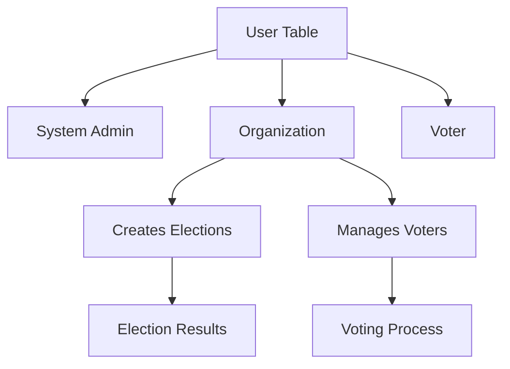
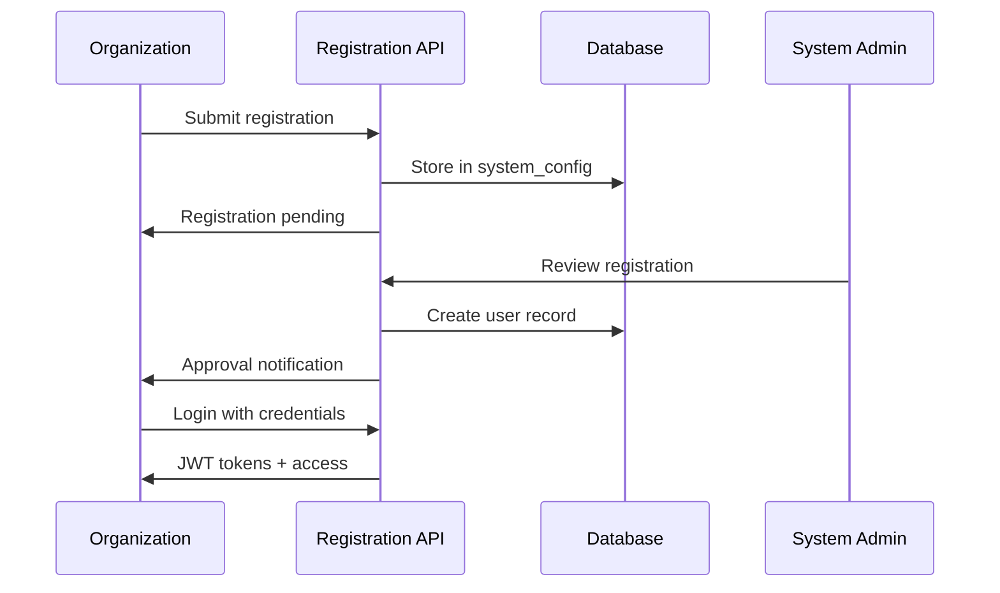
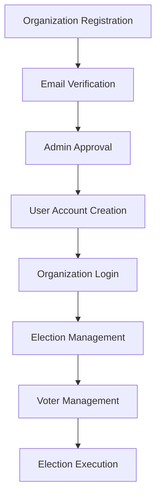
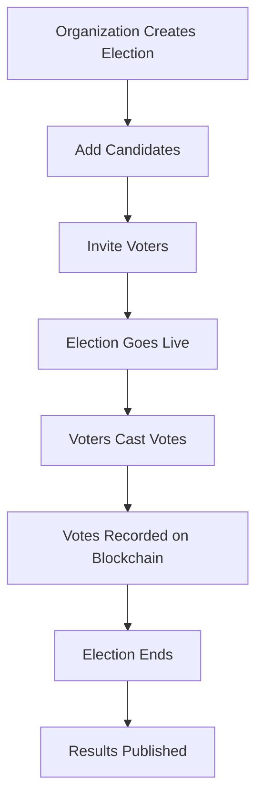
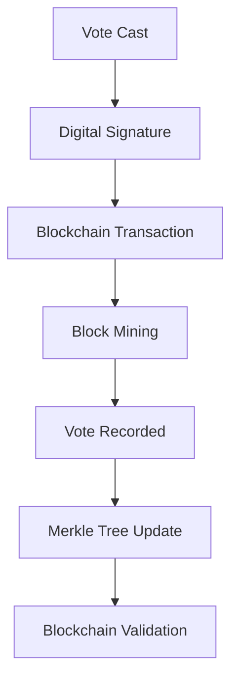

# 📊 BlockVote Data Model Documentation

**Version**: 0.2
**Last Updated**: October 2025
**Architecture**: Simplified Organization-as-Admin Model

## 📋 Table of Contents

- [Overview](#overview)
- [User Role Architecture](#user-role-architecture)
- [Database Schema](#database-schema)
- [Key Relationships](#key-relationships)
- [Authentication Flow](#authentication-flow)
- [Data Flow Diagrams](#data-flow-diagrams)
- [Migration Notes](#migration-notes)

## 🎯 Overview

BlockVote uses a **simplified data model** where organizations act as administrative users directly, eliminating the complexity of separate admin user accounts. This approach provides cleaner relationships, easier management, and better scalability.

**🎉 Migration Status: COMPLETE** - This model is fully implemented across the entire codebase.

### 🔑 Key Principles

1. **Single User Table**: All users (Admin, Organization, Voter) in one unified table
2. **Role-based Differentiation**: User roles determine permissions and capabilities
3. **Direct Organization Login**: Organizations authenticate directly without intermediate admin users
4. **Simplified Registration**: One-step organization registration with direct credentials
5. **Clear Relationships**: Elections belong to organizations (users with ORGANIZATION role)

## 👥 User Role Architecture

### 🏗️ **Simplified Role Model**



### 📊 **Role Definitions**

#### 1. **System Admin** (`role: "ADMIN"`)
```typescript
interface SystemAdmin extends User {
  role: "ADMIN";
  responsibilities: [
    "Approve organization registrations",
    "Manage platform settings",
    "Monitor system health",
    "Handle technical support"
  ];
}
```

#### 2. **Organization** (`role: "ORGANIZATION"`)
```typescript
interface Organization extends User {
  role: "ORGANIZATION";
  responsibilities: [
    "Create and manage elections",
    "Add/remove voters",
    "Monitor election progress",
    "View and export results"
  ];
  // Organizations directly own elections
  elections: Election[];
}
```

#### 3. **Voter** (`role: "VOTER"`)
```typescript
interface Voter extends User {
  role: "VOTER";
  responsibilities: [
    "Participate in assigned elections",
    "Cast secure votes",
    "View election results"
  ];
  // Voters participate in elections
  votes: Vote[];
  electionParticipation: ElectionVoter[];
}
```

## 🗄️ Database Schema

### 👤 **Users Table** (Core Entity)

```sql
CREATE TABLE users (
  id                    SERIAL PRIMARY KEY,
  username              VARCHAR(255) UNIQUE NOT NULL,
  email                 VARCHAR(255) UNIQUE NOT NULL,
  password_hash         VARCHAR(255) NOT NULL,
  role                  user_role NOT NULL,
  public_key           TEXT,
  private_key_encrypted TEXT,
  status               user_status DEFAULT 'ACTIVE',
  created_at           TIMESTAMP DEFAULT NOW(),
  updated_at           TIMESTAMP DEFAULT NOW()
);

-- Enum types
CREATE TYPE user_role AS ENUM ('ADMIN', 'ORGANIZATION', 'VOTER');
CREATE TYPE user_status AS ENUM ('ACTIVE', 'INACTIVE', 'SUSPENDED');
```

**Key Fields**:
- `username`: Login identifier (unique across all users)
- `email`: Contact email (unique, used for notifications)
- `password_hash`: bcrypt hashed password
- `role`: Determines user type and permissions
- `public_key`/`private_key_encrypted`: Blockchain voting keys
- `status`: Account status for access control

### 🗳️ **Elections Table**

```sql
CREATE TABLE elections (
  id              SERIAL PRIMARY KEY,
  title           VARCHAR(255) NOT NULL,
  description     TEXT NOT NULL,
  organization_id INTEGER REFERENCES users(id) ON DELETE CASCADE,
  status          election_status DEFAULT 'DRAFT',
  start_date      TIMESTAMP NOT NULL,
  end_date        TIMESTAMP NOT NULL,
  created_at      TIMESTAMP DEFAULT NOW(),
  updated_at      TIMESTAMP DEFAULT NOW()
);

CREATE TYPE election_status AS ENUM ('DRAFT', 'ACTIVE', 'COMPLETED', 'CANCELLED');
```

**Key Relationships**:
- `organization_id` → `users.id` (where `role = 'ORGANIZATION'`)
- Elections are **owned directly by organizations**

### 👥 **Election Voters Table** (Many-to-Many)

```sql
CREATE TABLE election_voters (
  id          SERIAL PRIMARY KEY,
  election_id INTEGER REFERENCES elections(id) ON DELETE CASCADE,
  voter_id    INTEGER REFERENCES users(id) ON DELETE CASCADE,
  invited_at  TIMESTAMP DEFAULT NOW(),
  voted_at    TIMESTAMP,

  UNIQUE(election_id, voter_id)
);
```

**Purpose**: Links voters to specific elections they can participate in

### 🎯 **Candidates Table**

```sql
CREATE TABLE candidates (
  id          SERIAL PRIMARY KEY,
  election_id INTEGER REFERENCES elections(id) ON DELETE CASCADE,
  name        VARCHAR(255) NOT NULL,
  description TEXT,
  image_url   VARCHAR(500),
  created_at  TIMESTAMP DEFAULT NOW()
);
```

### 🗳️ **Votes Table** (Blockchain Integration)

```sql
CREATE TABLE votes (
  id               SERIAL PRIMARY KEY,
  election_id      INTEGER REFERENCES elections(id) ON DELETE CASCADE,
  voter_id         INTEGER REFERENCES users(id) ON DELETE CASCADE,
  candidate_id     INTEGER REFERENCES candidates(id) ON DELETE CASCADE,
  blockchain_hash  VARCHAR(64) NOT NULL,
  signature        TEXT NOT NULL,
  voted_at         TIMESTAMP DEFAULT NOW(),

  UNIQUE(election_id, voter_id)  -- Prevent double voting
);
```

### 📝 **Audit Logs Table**

```sql
CREATE TABLE audit_logs (
  id          SERIAL PRIMARY KEY,
  user_id     INTEGER REFERENCES users(id),
  action      VARCHAR(100) NOT NULL,
  resource    VARCHAR(50) NOT NULL,
  resource_id INTEGER,
  details     TEXT,
  ip_address  INET,
  user_agent  TEXT,
  created_at  TIMESTAMP DEFAULT NOW()
);
```

### ⚙️ **System Config Table** (Flexible Configuration)

```sql
CREATE TABLE system_config (
  id         SERIAL PRIMARY KEY,
  key        VARCHAR(255) UNIQUE NOT NULL,
  value      TEXT NOT NULL,
  type       VARCHAR(50) DEFAULT 'STRING',
  created_at TIMESTAMP DEFAULT NOW(),
  updated_at TIMESTAMP DEFAULT NOW()
);
```

**Usage**: Stores organization registrations, system settings, and configuration data

## 🔗 Key Relationships

### 📊 **Entity Relationship Diagram**

```
Users (1) ----< Elections (N)
  |              |
  |              |
  |              v
  |         Candidates (N)
  |              |
  |              |
  v              v
ElectionVoters ----< Votes
  |
  |
Users (Voters)
```

### 🎯 **Relationship Details**

#### **One-to-Many Relationships**
- **Organization → Elections**: `users.id` ← `elections.organization_id`
- **Election → Candidates**: `elections.id` ← `candidates.election_id`
- **Election → Votes**: `elections.id` ← `votes.election_id`
- **User → Votes**: `users.id` ← `votes.voter_id` (for voters only)
- **User → AuditLogs**: `users.id` ← `audit_logs.user_id`

#### **Many-to-Many Relationships**
- **Elections ↔ Voters**: Through `election_voters` table
- **Voters ↔ Candidates**: Through `votes` table (with constraints)

### 🔐 **Data Constraints**

#### **Unique Constraints**
```sql
-- Users
ALTER TABLE users ADD CONSTRAINT unique_username UNIQUE (username);
ALTER TABLE users ADD CONSTRAINT unique_email UNIQUE (email);

-- Voting constraints
ALTER TABLE votes ADD CONSTRAINT unique_voter_per_election UNIQUE (election_id, voter_id);
ALTER TABLE election_voters ADD CONSTRAINT unique_voter_invitation UNIQUE (election_id, voter_id);

-- System configuration
ALTER TABLE system_config ADD CONSTRAINT unique_config_key UNIQUE (key);
```

#### **Check Constraints**
```sql
-- Role-based constraints
ALTER TABLE elections ADD CONSTRAINT check_organization_role
  CHECK (organization_id IN (
    SELECT id FROM users WHERE role = 'ORGANIZATION'
  ));

-- Status transitions
ALTER TABLE elections ADD CONSTRAINT check_date_order
  CHECK (start_date < end_date);
```

## 🔄 Authentication Flow

### 📋 **Organization Registration Process**



### 🔑 **Login Authentication**

```typescript
interface LoginProcess {
  input: {
    username: string;    // Organization username
    password: string;    // Organization password
  };

  process: [
    "Validate credentials against users table",
    "Check user status (ACTIVE required)",
    "Generate JWT access token",
    "Generate JWT refresh token",
    "Create audit log entry",
    "Return tokens + user info"
  ];

  output: {
    accessToken: string;
    refreshToken: string;
    user: {
      id: number;
      username: string;
      email: string;
      role: "ORGANIZATION";
    };
  };
}
```

## 📈 Data Flow Diagrams

### 🏢 **Organization Management Flow**



### 🗳️ **Election Lifecycle Flow**



### ⛓️ **Blockchain Integration Flow**



## ✅ Migration Completed

### ❌ **Removed Complexity** (Previous Model)
```typescript
// OLD: Complex adminUser structure
interface OldRegistration {
  organizationName: string;
  contactEmail: string;
  adminUser: {           // ❌ Removed
    username: string;
    email: string;
    password: string;
    firstName: string;
    lastName: string;
  };
}
```

### ✅ **Simplified Model** (Current)
```typescript
// NEW: Direct organization credentials
interface NewRegistration {
  organizationName: string;
  contactEmail: string;    // Becomes User.email
  contactName: string;
  username: string;        // Becomes User.username
  password: string;        // Becomes User.passwordHash (hashed)
  // ... other org details
}
```

### 📊 **Benefits of Simplified Model**

#### **Reduced Complexity**
- ✅ 50% fewer registration fields
- ✅ Direct organization authentication
- ✅ Simpler API endpoints
- ✅ Easier user management

#### **Better Performance**
- ✅ Fewer database joins
- ✅ Simplified queries
- ✅ Reduced storage overhead
- ✅ Faster authentication lookups

#### **Improved Maintainability**
- ✅ Single source of truth for users
- ✅ Clearer data relationships
- ✅ Simpler backup/migration procedures
- ✅ Easier debugging and monitoring

### ✅ **Migration Completed**

**All migration tasks have been successfully completed:**

- ✅ Update registration API endpoints
- ✅ Simplify registration forms
- ✅ Update authentication logic
- ✅ Migrate existing organization data
- ✅ Update test suites (309/309 tests passing)
- ✅ Update documentation
- ✅ Test all authentication flows
- ✅ Verify blockchain integration compatibility
- ✅ Update Phase 3 enhancements (37/37 tests passing)

## 📚 Developer Guidelines

### 🔍 **Query Patterns**

#### **Get Organization Elections**
```typescript
const orgElections = await prisma.election.findMany({
  where: {
    organizationId: user.id,  // Direct relationship
    status: 'ACTIVE'
  },
  include: {
    candidates: true,
    votes: true,
    _count: {
      select: { votes: true }
    }
  }
});
```

#### **Check Voter Eligibility**
```typescript
const canVote = await prisma.electionVoter.findFirst({
  where: {
    electionId: electionId,
    voterId: user.id,
    election: {
      status: 'ACTIVE',
      startDate: { lte: new Date() },
      endDate: { gte: new Date() }
    }
  }
});
```

#### **Create Organization User**
```typescript
const organization = await prisma.user.create({
  data: {
    username: registrationData.username,
    email: registrationData.contactEmail,
    passwordHash: hashedPassword,
    role: 'ORGANIZATION',
    status: 'ACTIVE'
  }
});
```

### 🔒 **Security Considerations**

#### **Access Control Patterns**
```typescript
// Verify organization owns election
async function verifyElectionOwnership(userId: number, electionId: number) {
  const election = await prisma.election.findFirst({
    where: {
      id: electionId,
      organizationId: userId  // Direct ownership check
    }
  });

  if (!election) {
    throw new Error('Election not found or access denied');
  }

  return election;
}
```

#### **Role-based Queries**
```typescript
// Get elections based on user role
async function getUserElections(user: User) {
  if (user.role === 'ORGANIZATION') {
    // Organization sees their own elections
    return prisma.election.findMany({
      where: { organizationId: user.id }
    });
  }

  if (user.role === 'VOTER') {
    // Voter sees elections they're invited to
    return prisma.election.findMany({
      where: {
        voters: {
          some: { voterId: user.id }
        }
      }
    });
  }

  if (user.role === 'ADMIN') {
    // Admin sees all elections
    return prisma.election.findMany();
  }
}
```

## 🎯 Performance Optimization

### 📊 **Database Indexes**

```sql
-- Critical indexes for performance
CREATE INDEX idx_users_role ON users(role);
CREATE INDEX idx_users_email ON users(email);
CREATE INDEX idx_users_username ON users(username);

CREATE INDEX idx_elections_organization ON elections(organization_id);
CREATE INDEX idx_elections_status ON elections(status);
CREATE INDEX idx_elections_dates ON elections(start_date, end_date);

CREATE INDEX idx_votes_election ON votes(election_id);
CREATE INDEX idx_votes_voter ON votes(voter_id);
CREATE INDEX idx_votes_blockchain_hash ON votes(blockchain_hash);

CREATE INDEX idx_election_voters_election ON election_voters(election_id);
CREATE INDEX idx_election_voters_voter ON election_voters(voter_id);

CREATE INDEX idx_audit_logs_user ON audit_logs(user_id);
CREATE INDEX idx_audit_logs_created ON audit_logs(created_at);
```

### 🚀 **Query Optimization Tips**

1. **Use Role-based Filtering**: Always filter by user role when appropriate
2. **Leverage Indexes**: Design queries to use the indexes above
3. **Minimize Joins**: The simplified model reduces join complexity
4. **Pagination**: Use cursor-based pagination for large datasets
5. **Caching**: Cache frequently accessed organization and election data

## 📋 Conclusion

The simplified **organization-as-admin model** provides a clean, efficient, and maintainable data architecture for BlockVote. By eliminating the complexity of separate admin users, the system becomes easier to develop, test, and maintain while providing all necessary functionality for secure election management.

### ✅ **Key Advantages**

- **Simplified Architecture**: Direct organization authentication
- **Better Performance**: Fewer joins and queries
- **Easier Development**: Clear relationships and patterns
- **Enhanced Security**: Simplified access control
- **Improved Testing**: Fewer edge cases and scenarios

This data model forms the foundation for all BlockVote functionality and provides a solid base for future enhancements and scaling.

---

**✅ Migration Complete**: October 2025
**🔄 Last Updated**: October 2025
**👥 Maintainers**: Muhammad Thariq
**📄 Related Docs**: [Development Roadmap](../DEVELOPMENT_ROADMAP.md), [API Documentation](../src/app/api/), [Database Schema](../prisma/schema.prisma)

**🎯 Current Status**: All systems fully operational with simplified organization-as-admin model
